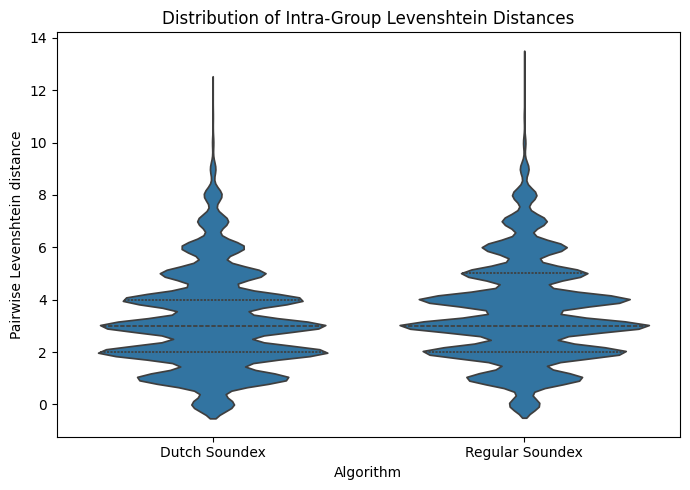
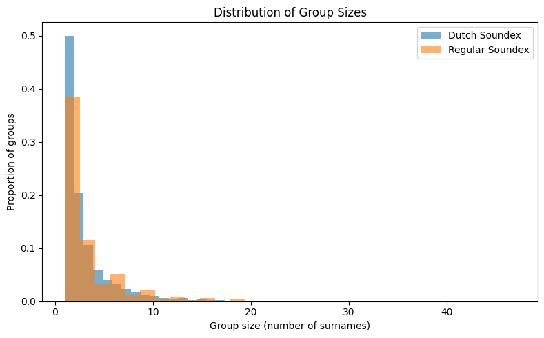

# Dutch Soundex: A Language-Specific Phonetic Algorithm for Dutch Surnames

## Overview

This project **introduces and documents the Dutch Soundex algorithm**, a language-specific phonetic encoding method designed to capture the unique sound patterns of Dutch surnames.  
It also provides a **systematic, quantitative evaluation** of Dutch Soundex versus the classic (Anglo-centric) Soundex algorithm for clustering Dutch surnames by phonetic similarity.

Phonetic clustering is crucial for applications such as genealogy, database deduplication, and fuzzy name search. This approach is fully reproducible and open source.

Using Levenshtein (edit) distance as a measure of within-group and between-group similarity, it is demonstrated that Dutch Soundex produces significantly more homogenous clusters for Dutch surnames than the regular Soundex. Bootstrap confidence intervals and statistical tests on all intra-group pairs in this dataset confirm the statistical significance of these results (see table below).

## Dutch Soundex: Algorithm Description

The Dutch Soundex algorithm builds on the classic Soundex framework, but includes targeted preprocessing and a custom mapping to better fit Dutch language features.

#### **1. Preprocessing**

Certain Dutch letter combinations are converted to reflect typical Dutch pronunciation:

- `"ch"` → `"g"` (as in *Schip* pronounced “Sgip”)
- `"ck"` → `"k"` (redundant 'c')
- `"ks"` → `"x"` (as in *laks* pronounced "lax")
- `"sj"` → `"s"` (common letter combination similar to "s")
- `"ng"` → `"n"` (to merge nasal sounds)

#### **2. Letter-to-Digit Mapping**

The algorithm uses a custom mapping reflecting Dutch phonetic groups. Each letter (except the first, which is kept as the starting letter of the code) is mapped to a digit as follows:

| Letter(s) | Digit |
|-----------|-------|
| b, p      |   0   |
| d, t      |   1   |
| f, v, w   |   2   |
| g         |   3   |
| k, c, q   |   4   |
| x         |   5   |
| l         |   6   |
| m, n      |   7   |
| r         |   8   |
| s, z      |   9   |

Vowels and certain consonants are ignored after the first letter.

#### **3. Code Construction**

- The code begins with the **first letter** of the (preprocessed) name.
- Next, map each subsequent letter to its corresponding digit, skipping consecutive duplicate digits.
- Continue until you have four characters (padding with zeros if necessary).

## Dutch Soundex: Performance

Clustering performance was evaluated using the top 5% most frequent Dutch surnames from the 1947 census. The data is from [CBG Familienamen (Dutch Family Names)](https://www.cbgfamilienamen.nl/nfb/index.php) available in [Namenlijsten by Bart Broere](https://github.com/bartbroere/namenlijsten).

### **Quantitative Comparison**

**Analysis details:**
- Number of names: 5,695
- Number of Dutch Soundex groups: 2,255
- Number of Regular Soundex groups: 1,786

|                 | Mean Intra-group Levenshtein | Mean Inter-group Levenshtein | Intra/Inter Ratio |
|:----------------|:----------------------------:|:----------------------------:|:-----------------:|
| Dutch Soundex   | 3.168                        | 6.692                        | 0.473             |
| Regular Soundex | 3.512                        | 6.691                        | 0.525             |

**Difference in mean intra-group distance (Dutch - Regular):** -0.344 (95% bootstrap CI: -0.382 to -0.306, p-value = 0.0000)

This difference is **statistically significant** (p < 0.05), confirming that Dutch Soundex forms clusters of surnames that are, on average, more similar.

### **Intra-Group Distance**

The violin plot below illustrates the distribution of pairwise Levenshtein distances within groups for both algorithms. **Dutch Soundex** clusters exhibit a lower median distance and a more concentrated distribution of low distances, indicating more homogeneous clusters than those formed by the regular Soundex.

### **Group Size Distribution**

The bar plot below shows the distribution of group sizes. Dutch Soundex produces more singleton groups (groups containing only one surname) and generally more small clusters, while regular Soundex creates slightly more large groups.

### **Conclusion**

**Dutch Soundex** more effectively captures the structure and phonology of Dutch surnames, producing tighter and more internally consistent clusters. This is demonstrated by lower intra-group Levenshtein distances and a better intra/inter ratio compared to **regular Soundex**, which was designed for English and tends to yield less homogeneous groupings. **These improvements are statistically significant for this dataset.**

## License

This project is licensed under the MIT License. See the [LICENSE](LICENSE) file for details.
